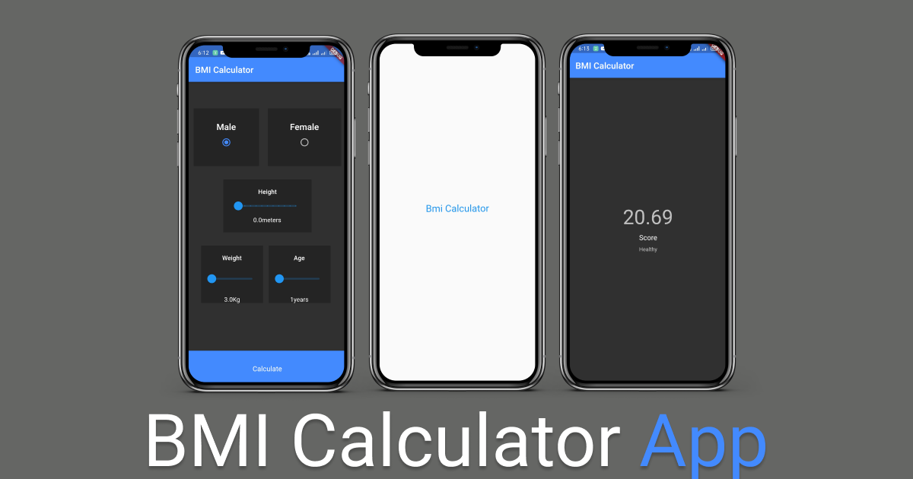

# bmi_calculator_app

## Getting Started

This project is a starting point for a Flutter application.

A few resources to get you started if this is your first Flutter project:

- [Lab: Write your first Flutter app](https://flutter.dev/docs/get-started/codelab)
- [Cookbook: Useful Flutter samples](https://flutter.dev/docs/cookbook)

For help getting started with Flutter, view our
[online documentation](https://flutter.dev/docs), which offers tutorials,
samples, guidance on mobile development, and a full API reference.

## About The Project
Bmi calculator app build with Flutter

Learning  
* <code>Dart</code>
* <code>bmi-calculator</code> 
* <code>flutter-apps</code> 
* <code>scaffold</code> 
* <code>splashscreen</code> 
* <code>statefulwidgets and statelesswidgets</code>

### Built With
* Android Studio

<!-- GETTING STARTED -->
## Getting Started

### Prerequisites
* Flutter SDK
* Dart programming
* Android Studio or VS Code

## Contributing

Contributions are what make the open source community such an amazing place to be learn, inspire, and create. Any contributions you make are **greatly appreciated**.

1. Fork the Project
2. Create your Feature Branch 
3. Commit your Changes
4. Push to the Branch
5. Open a Pull Request

<!-- CONTACT -->
## Contact

Name - [Jaspreet Singh](https://www.linkedin.com/in/jaspreetsidhu13/)

Project Link: [bmi calculator app](https://github.com/jaspreetsidhu3/bmi_calculator_app)
